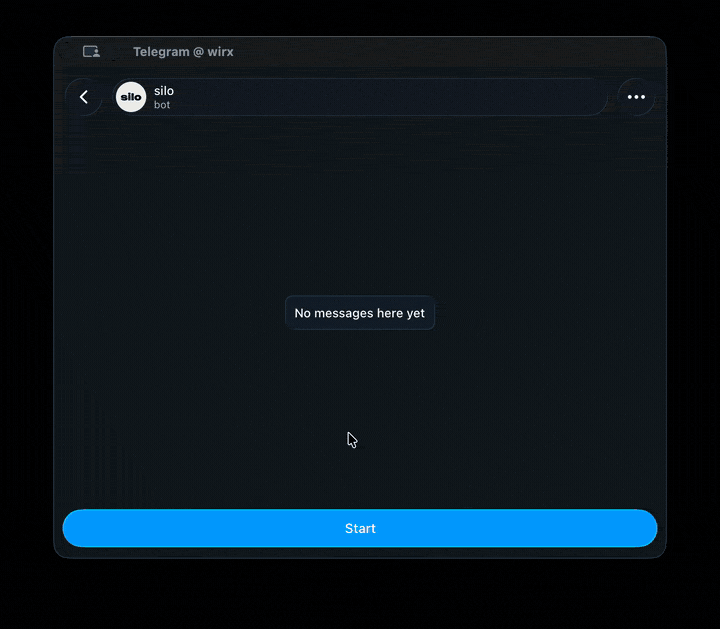

# Silo


### Your entire bot fleet. One chat. Zero terminal.

You've got bots scattered across a server, each one a `screen` session you're afraid to close,
an `.env` file you can't remember the shape of, a `pip install` you're praying doesn't collide
with the one next to it. One of them goes down at 3am and you find out from an angry user, not
from your server.

**Silo ends that.** Send it a GitHub link or a zip file, from Telegram, and thirty seconds later
your bot is live — built, isolated, monitored, and yours to control with a tap, forever, from
your phone.

<p align="center">
  
</p>

## Why people who try this don't go back to a terminal

- **Install by sending a link.** GitHub repo or zip file, dropped straight into the chat. No SSH,
  no `git clone`, no dependency wrangling — it's built and running before you'd have finished
  typing the commands by hand.
- **Every bot lives in a sealed box.** Real isolation — the same class of sandboxing container
  platforms are built on — so one bot's bad dependency, memory leak, or bug can never touch
  another bot, your server, or your data. Nothing spills over. Ever.
- **It watches your fleet so you don't have to.** A bot crashes, fails to build, restart-loops, or
  runs low on a required secret — you know in seconds, not when a user complains. The server
  running hot gets flagged before it becomes an outage.
- **It heals itself.** Crashed bots come back with sensible backoff, no page needed. Reboot the
  server and everything you marked autostart is back up before you've poured coffee.
- **Your secrets are actually secret.** Every key and token is encrypted the instant you send it,
  and scrubbed automatically from logs, errors, and alerts — so a stray `print()` in someone's bot
  can never leak a credential to the whole chat.
- **It speaks your language, not just English.** Full Russian and English interfaces, switching
  automatically to match your Telegram client.
- **GitHub, linked with one tap.** No copy-pasting personal access tokens — approve a code on
  github.com and you're connected.
- **It's entirely yours.** No cloud dashboard, no subscription, no third party in the loop besides
  Telegram and GitHub. It runs on hardware you control, and the moment you stop paying attention
  to it, it keeps running anyway.

## Five minutes from clone to live control panel

You need three things: a small server or machine with
[Docker](https://docs.docker.com/get-docker/), a bot token from [@BotFather](https://t.me/BotFather),
and your numeric Telegram ID from [@userinfobot](https://t.me/userinfobot).

```
git clone https://github.com/VladislavKrasnov/silo.git
cd silo
cp .env.example .env
```

Open `.env` and fill in two lines:

```
MASTER_BOT_TOKEN=the token BotFather gave you
ADMIN_IDS=your numeric Telegram ID
```

Then:

```
docker compose up -d --build
```

Open a chat with your bot, send `/start`, and you're looking at your live control panel.
**Projects → Install** is where your first bot goes in.

## Commands

Everything is a tap away, but the full command set is here if you'd rather type:

| Command | What it does |
|---|---|
| `/start` | Opens the main menu, with a live status summary and quick-access buttons. |
| `/stop` | Lists running bots to pick one to stop (or stops it directly, with `/stop <name>`). |
| `/restart` | Lists running bots to pick one to restart (or restarts it directly, with `/restart <name>`). |
| `/status` | A detailed snapshot: server load, memory, disk, and per-bot health. |
| `/projects` | Install, inspect, rebuild, update, or remove any bot. |
| `/env` | Add, replace, or delete a bot's API keys and secrets. |
| `/logs <name>` | The most recent output from a bot. |
| `/events` | A history of everything that's happened across the fleet. |
| `/settings` | Alerts, thresholds, quiet hours, language, and connected GitHub accounts. |
| `/help` | The full command list. |
| `/cancel` | Backs out of any multi-step action. |

## Built on

Python, the Telegram Bot API, real OS-level sandboxing, and AES-256 encryption for anything
sensitive. No paid add-ons, no external database, no vendor lock-in — one self-hosted application
you own outright, top to bottom.

<details>
<summary><strong>Advanced: all configuration options</strong></summary>

Set these in your `.env` file. Only the first two are required — sensible defaults cover
everything else.

| Variable | Required | What it's for |
|---|---|---|
| `MASTER_BOT_TOKEN` | yes | Your Telegram bot's token. |
| `ADMIN_IDS` | yes | Telegram user IDs allowed to operate the panel, comma-separated. |
| `PROJECTS_ROOT_DIR` | no | Where installed bots live on disk. |
| `STATE_DIR` | no | Where the orchestrator keeps its own private data. |
| `ISOLATION_BACKEND` | no | Which sandbox technology to use: `auto`, `bubblewrap`, `docker`, or `native`. Leave on `auto`. |
| `CONTAINER_IMAGE` | no | The base image used when running bots through Docker isolation. |
| `AUTOSTART_PROJECTS` | no | Whether bots marked "autostart" come up automatically on boot. |
| `ORCHESTRATOR_MASTER_KEY` | no | An encryption key you supply yourself instead of letting one be generated. Set this if your server's disk isn't persistent. |
| `GITHUB_OAUTH_CLIENT_ID` | no | Enables one-tap GitHub linking instead of pasting a token by hand. |

</details>

<details>
<summary><strong>Advanced: running without Docker</strong></summary>

If you'd rather run it directly on a Linux server instead of through Docker:

```
apt-get install -y bubblewrap git python3-venv
python -m venv .venv
source .venv/bin/activate
pip install -r requirements.txt
cp .env.example .env      # fill in MASTER_BOT_TOKEN and ADMIN_IDS
python -m app
```

For a server that should keep it running permanently, wire it up as a `systemd` service pointing
at `python -m app`, with `Restart=on-failure`. Without `bubblewrap`, bots run without filesystem
isolation, which is fine for trying things out but not for anything you'd expose to real users.

</details>

## License

Released under the MIT License. See `LICENSE`.
